# cmake_tutorial (Step 6)
In this step, we split the big function `expected_answer` into several small functions in different files. So we need to add more subdictionaries in the CMakeLists.txt file.
```cmake
# CMakeLists.txt
add_subdirectory(answer)
add_subdirectory(curl_wrapper)
add_subdirectory(wolfram)
```
The most important thing is to figure out the dependencies among these files.



And the point is that you can link the files between different subdictionaries.

---
The command is the same as step 3:

```bash
cmake -B build      # add a folder named build to store the build files
cmake --build build # build the project
./build/answer_app  # run the project
```

## Next step
Type `git checkout cmake_07` to learn more about cmake.
